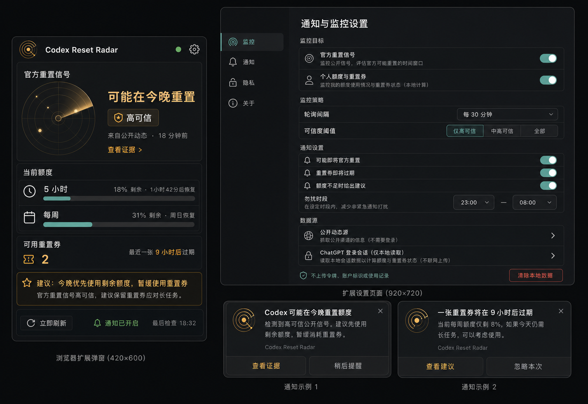
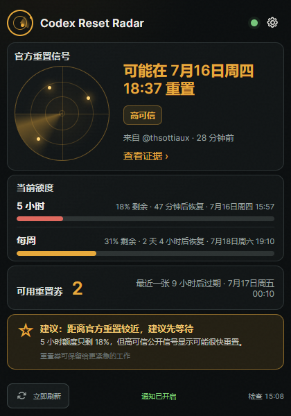
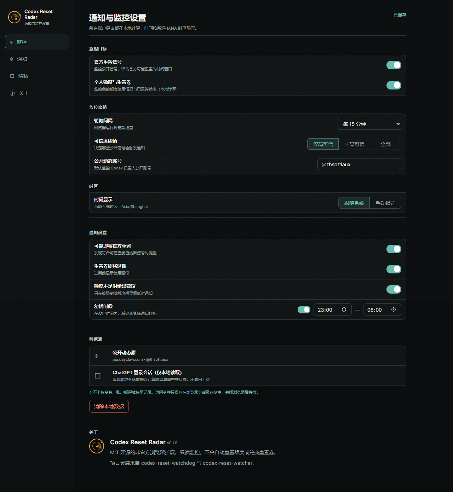

# Codex Reset Radar

[简体中文](README.zh-CN.md)

Codex Reset Radar is a local-first Chrome/Edge extension that combines:

- possible official Codex quota-reset signals from public posts
- current 5-hour and weekly usage windows
- banked reset-credit count and expiry times
- read-only advice about whether to spend or hold a reset credit
- native browser notifications



## Implemented interface





> [!IMPORTANT]
> This is an unofficial community project. It is not affiliated with or
> endorsed by OpenAI. The extension never redeems reset credits or changes your
> account.

## Why this exists

An official reset announcement and a banked reset credit answer different
questions:

1. **Could OpenAI reset limits soon?**
2. **Should I use a reset credit right now?**

Codex Reset Radar puts both decisions in one compact browser surface.

## Features

- **Official-reset radar** — checks a public Dayclaw source for new posts and
  applies a deterministic, testable reset-signal classifier.
- **Quota monitor** — shows known 5-hour and weekly windows without guessing
  when the backend omits a trustworthy duration.
- **Banked resets** — uses the authoritative available count and shows the
  nearest known expiry.
- **Advice engine** — blocked state, expiring credits, official signals,
  short-window refill timing, weekly capacity, and reset count are evaluated in
  a strict priority order.
- **Time-zone aware** — stores UTC/Unix timestamps and renders them using the
  system IANA time zone or a valid manual override.
- **Native notifications** — supports official-reset signals, credit expiry,
  quota advice, action buttons, and quiet hours.
- **Local-first privacy** — no project server, analytics, telemetry, or API key.

## Install from source

1. Download or clone this repository.
2. Run:

   ```bash
   npm install
   npm run verify
   ```

3. Open `chrome://extensions` or `edge://extensions`.
4. Enable **Developer mode**.
5. Choose **Load unpacked**.
6. Select the repository directory.
7. Sign in to ChatGPT in the same browser.

The build command also creates a distributable zip under `dist/`.

## Permissions

| Permission | Why it is needed |
| --- | --- |
| `storage` | Save settings, sanitized quota snapshots, signal IDs, and notification dedupe state |
| `alarms` | Schedule durable Manifest V3 background checks |
| `notifications` | Display native system notifications |
| `tabs` | Open evidence/settings and ask an existing ChatGPT tab for a fresh read |
| `https://chatgpt.com/*` | Read Codex usage and reset-credit metadata from the existing login |
| `https://api.dayclaw.com/*` | Read the configured public reset-signal source |

See [PRIVACY.md](PRIVACY.md) for the complete data boundary.

## Time zones

Backend timestamps remain UTC/Unix values. The popup, settings page, quiet
hours, and notification copy convert them at render time with
`Intl.DateTimeFormat`.

Default: follow the browser/system IANA time zone.

Manual examples:

- `Asia/Shanghai`
- `America/Los_Angeles`
- `Europe/London`
- `UTC`

Invalid manual time zones are rejected and never silently used.

## Advice priority

The engine evaluates in this order:

1. Account blocked now
2. Reset credit expires within 24 hours
3. High-confidence future official-reset signal
4. Missing or partial account data
5. Very low 5-hour capacity and refill distance
6. Low weekly capacity and weekly reset distance
7. Healthy capacity / hold advice

Advice is informational. The user must redeem a credit inside an official
Codex surface.

## Development

```bash
npm test
npm run lint
npm run build
npm run verify
```

The project intentionally uses plain Manifest V3 JavaScript, HTML, and CSS:
there is no runtime framework and no remotely hosted code.

## Architecture

```text
Public Dayclaw items ──> deterministic signal classifier ─┐
                                                         ├─> advice engine ─> popup / badge / notifications
ChatGPT usage + reset credits ─> tolerant normalization ─┘
```

Persistent storage contains derived display values only. A short-lived access
token may be cached in `chrome.storage.session`, never local persistent
storage.

## Attribution

The project directly ports and adapts MIT-licensed ideas/code from
`jordan-edai/codex-reset-watcher` and
`codexquotamonitor/codex-quota-monitor`.

It is also inspired by `thinkingjimmy/codex-reset-watchdog`; no source from
that repository is included because its license was not exposed at the
referenced revision. See [THIRD_PARTY_NOTICES.md](THIRD_PARTY_NOTICES.md).

## License

[MIT](LICENSE)
